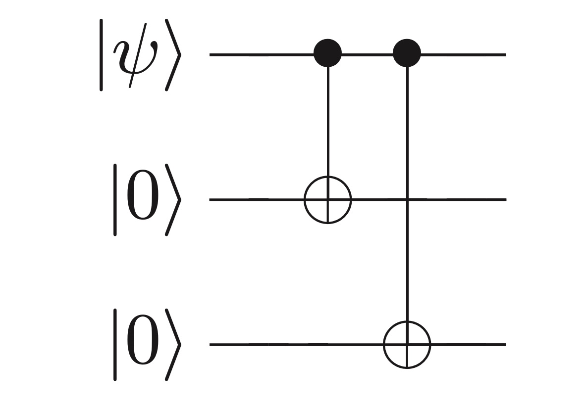
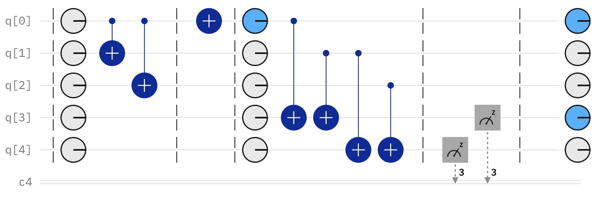

# The Three Qubit Repetition Code

## Overview

Quantum information stored as a qubit is inherently unstable, and prone to error. The key idea behind quantum error correction (QEC) is that we may encode information to protect it from noise, allowing us to detect when an error has occured (in this context an unintentional bit-flip) and allowing us to decode this error to retrieve our initial state.

## The classical error correction

One way of preventing this kind of error within classical communication channels is via repetition code. Say we are sending a bit with the value $1$: we simply replicate this, such that $1 \to 111$, and send this information through our system. The effect of noise within our system is to flip a bit, and this error occurs with probability $p$. It is therefore clear why repetition of the same bit reduces our uncertainty when an error occurs. Suppose the signal $110$ was recieved at the other end of our communication channel - we can deduce with high certainty that the information that was originally sent was in the form $111$, and hence we can re-translate (decode) the information $111 \to 1$.

## Quantum error correction

This procedure is not quite as simple in quantum systems, for a few reasons:

- The no cloning theorem: Cloning a quantum state to produce an identical copy is forbidden.
- Errors in quantum mechanics are continuous: Given this, determining which error had occured in order to correct it would require infinite precision.
- Measurement destroys quanutm information

## The Solution

Fortunately, there are ways we can work around these problems.

Consider the arbitrary qubit $| \Psi \rangle = \alpha |0 \rangle + \beta |1 \rangle$, which we are going to send through our system. We can encode this into three qubits as $|\Psi_2 \rangle = \alpha |000 \rangle + \beta |111 \rangle$ in the following manner:

  

 

Let some error occur after this encoding, in the form of an unexpected bit-flip of one of the three qubits. How might we detect wether an error has occured, which error has occured (if any), and how to decode the original information?

We perform an error-detection via syndrom diagnosis, by interacting our state $|\Psi_2$ after the error with two ancilla qubits in the state $|0\rangle$. Two CNOT gates are applied to each ancilla: on the first, the control is set to our first and then second qubits, and on the second the control is set to our second and third. The results of the two CNOT gates give us $S_1$ and $S_2$, our syndrome diagnosis. Based on the reuslts of $S_1$ and $S_2$, we can say what error has occured within our system:

| $S_1$  | $S_2$ | Error |
| ------------- | ------------- | ------------- |
| 0  |  0  | No Error  |
| 0  |  1  | Third qubit flip  |
| 1  |  0  | First qubit flip  |
| 1  |  1  | Second Qubit flip  |

  

<i>The three qubit repetition circuit for bit-flip errors. We can see that after our encoding, we enforce a bit flip on the first qubit to simulat a bit flip error. We then see that using our ancilla qubits, we read the syndrom as $| 1 0 \rangle$, and hence deduce that the first bit has been fipped.</i>

 
